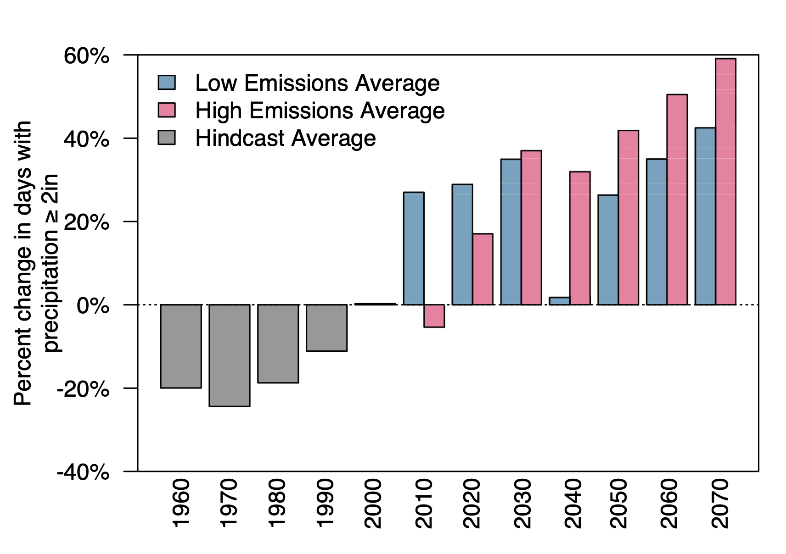
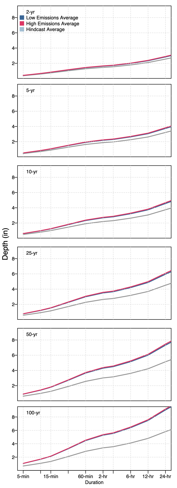
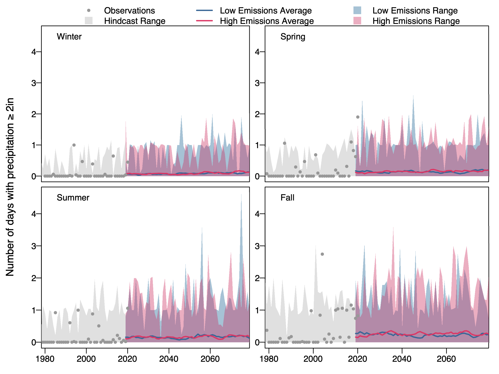
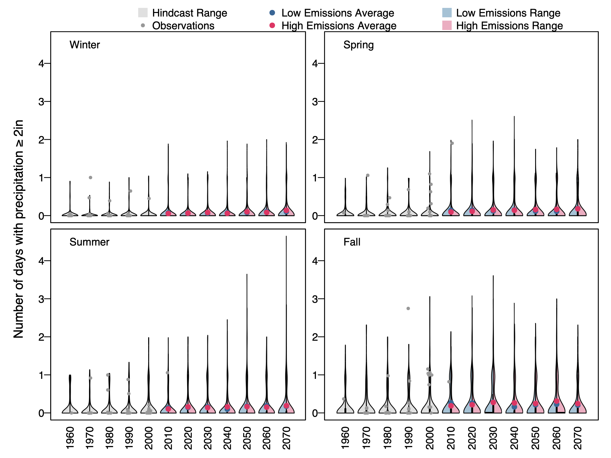
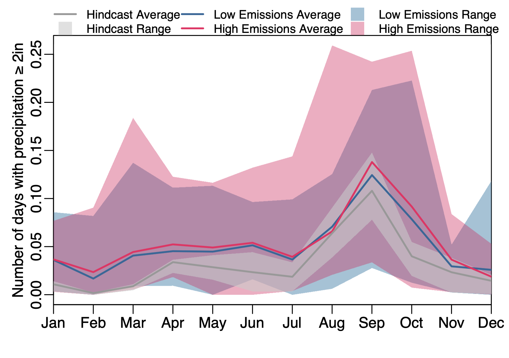

# Visuals/ Questions

## <a href="#A">A. Control Statement</a>

## <a href="#B">B. Yearly Graph</a>
* <a href="#B1">Group 1</a>
* <a href="#B2">Group 2</a>
* <a href="#B3">Group 3</a>
* <a href="#B4">Group 4</a>

## <a href="#C">C. Seasonal Graph</a>
* <a href="#C1">Group 1</a>
* <a href="#C2">Group 2</a>
* <a href="#C3">Group 3</a>
* <a href="#C4">Group 4</a>

## <a id="A">A. Control Statement</a>

Heavy rainfall in Pulaski County is increasing in frequency and intensity, causing property damage, septic backups, well contamination, mold and indoor air quality issues, and impacts to water quality
in local streams. Annually, Pulaski County, VA receives 40 inches of precipitation on average, with roughly 1 day having precipitation of at least 2 inches. It is usually wettest during the summer months. Within the next 50 years (by the 2070s), the number of heavy precipitation days will likely increase by an average of 43 to 58% (compared to the 1990-2019 average).

## <a id="B">B. Yearly Graph</a>

### <a id="B1">Group 1</a>
##### Variations:
* Polygon/ line graph
* Number of days with heavy rainfall (2 inches)
* Observations included
* Ranges included
* Averages included

##### Take aways:
* There are more years with multiple events at the end of the historical period than at the beginning, indicating that there has been an increase over the historical period.
* There does not appear to be much change in the average over time.
* There are minor differences between RCP4.5 (low) and RCP8.5 (high).
* The maximum spikes appear to be increasing over time.

### <a id="B2">Group 2</a>
##### Variations:
* Bar graph
* Percent change in the number of days with heavy rainfall (2 inches)
* NO observations included
* NO ranges included
* Averages included

##### Take aways:
* RCP45 and RCP85 averages both show a positive trend.
* Extreme events will likely increase by ~40% under RCP45 and ~60% under RCP85.
* There are differences between RCP4.5 (low) and RCP8.5 (high).

### <a id="B3">Group 3</a>
##### Variations:
* Violin graph
* Number of days with heavy rainfall (2 inches)
* Observations included
* Ranges included
* Averages included

##### Take aways:
* RCP45 and RCP85 averages both show a positive although small trend. The average will still stay around 1 day per year.
* The number of extreme events are becoming more skewed with each decade, where some years could see as many as 4 days a year with at least 2 inches of precipitation.
* Some observations correspond with the hindcast peaks. 
* There are minor differences between RCP4.5 (low) and RCP8.5 (high).

### <a id="B4">Group 4</a>
##### Variations:
* IDF graph
* 2, 5, 10, 25, 50, 100-yr return period
* NO oservations included
* NO Ranges included
* Averages included
* * Time period 1950-1999 compared to 2020-2069

##### Take aways:
* The current plot is ugly and needs to be redone
* RCP45 and RCP85 average both show that storms are increasing in intensity. For example, it would take ~3hr for 2 inches of precipitation to accrue under a 10-yr event, however under RCP4.5 and RCP8.5 2inches of precipitation could fall in under 1 hour for a 10-yr event.
* There are minor differences between RCP4.5 (low) and RCP8.5 (high).

## <a id="C">C. Seasonal Graph</a>

### <a id="C1">Group 1</a>
##### Variations:
* Polygon/ line graph
* Number of days with heavy rainfall (2 inches)
* Observations included
* Ranges included
* Averages included
* 4 seasons

##### Take aways:
* There does not appear to be much change in the average over time.
* The majority of extreme events occurance in summer and fall.
* There are minor differences between RCP4.5 (low) and RCP8.5 (high).
* The maximum spikes appear to be increasing over time.

### <a id="C2">Group 2</a>
##### Variations:
* Bar graph
* Percent change in the number of days with heavy rainfall (2 inches)
* NO observations included
* NO ranges included
* Averages included

##### Take aways:
* RCP45 and RCP85 averages both show a positive trend in winter, spring, and summer.
* Extreme events are increasing the most in winter and spring. 
* There are differences between RCP4.5 (low) and RCP8.5 (high).

### <a id="C3">Group 3</a>
##### Variations:
* Violin graph
* Number of days with heavy rainfall (2 inches)
* Observations included
* Ranges included
* Averages included

##### Take aways:
* It is hard to detect any change in the RCP45 and RCP85 averages.
* The number of extreme events are becoming more skewed with each decade.
* The majority of extreme events occurance in summer and fall.
* Some observations correspond with the hindcast peaks. 
* There are minor differences between RCP4.5 (low) and RCP8.5 (high).

### <a id="C4">Group 4</a>
##### Variations:
* Seasonal cycle graph
* Number of days with heavy rainfall (2 inches)
* NO oservations included
* Ranges included
* Averages included
* Time period 1950-1999 compared to 2020-2069

##### Take aways:
* The RCP45 and RCP85 averages are greater than the hindcast average across all months, indicating there will likely be a increase in the average number of events throughout the year.
* The number of extreme events are becoming more skewed with each decade.
* The majority of extreme events occur in late summer peaking in September.
* Maximum ranges indicate more extreme events could occur in spring (March) as well as a longer peak in the summer from August through October. 
* There are minor differences between RCP4.5 (low) and RCP8.5 (high).

