# Visuals/ Questions

## <a href="#A">A. Control Statement</a>

## <a href="#B">B. Yearly Graph</a>
* <a href="#B1">Group 1</a>
* <a href="#B2">Group 2</a>
* <a href="#B3">Group 3</a>
* <a href="#B4">Group 4</a>

## <a href="#C">C. Seasonal Graph</a>
* <a href="#C1">Group 1</a>
* <a href="#C2">Group 2</a>
* <a href="#C3">Group 3</a>
* <a href="#C4">Group 4</a>

## <a id="A">A. Control Statement</a>

### Pulaski County
Heavy rainfall in Pulaski County is increasing in frequency and intensity, causing property damage, septic backups, well contamination, mold and indoor air quality issues, and impacts to water quality in local streams. Annually, Pulaski County, VA receives 40 inches of precipitation on average, with roughly 1 day (0.79) having precipitation of at least 2 inches. It is usually wettest during the summer months. Within the next 50 years (by the 2070s), the number of heavy precipitation days will likely increase by an average of 43 to 58% (compared to the 1990-2019 average).

### Appomattox County
Heavy rainfall in Appomattox County is increasing in frequency and intensity, causing property damage, septic backups, well contamination, mold and indoor air quality issues, and impacts to water quality in local streams. Annually, Appomattox County, VA receives 45 inches of precipitation on average, with roughly 1 day (1.32) having precipitation of at least 2 inches. It is usually wettest during the spring months. Within the next 50 years (by the 2070s), the number of heavy precipitation days will likely increase by an average of 30 to 44% (compared to the 1990-2019 average).

## <a id="B">B. Yearly Graph</a>
This is a common plot used. We want to improve upon this style of plotting for precipitation.

### <a id="B1">Group 1</a>
##### Variations:
* Polygon/ line graph
* Number of days with heavy rainfall (2 inches)
* Observations included
* Ranges included
* Averages included

##### Take aways:
* There are more years with multiple events at the end of the historical period than at the beginning, indicating that there has been an increase over the historical period.
* There does not appear to be much change in the average over time.
* There are minor differences between RCP4.5 (low) and RCP8.5 (high).
* The maximum spikes appear to be increasing over time.

<!--  -->

<table border="0">
 <tr>
    <td><b>Pulaski County</b></td>
    <td><b>Appomattox County</b></td>
 </tr>
 <tr>
    <td>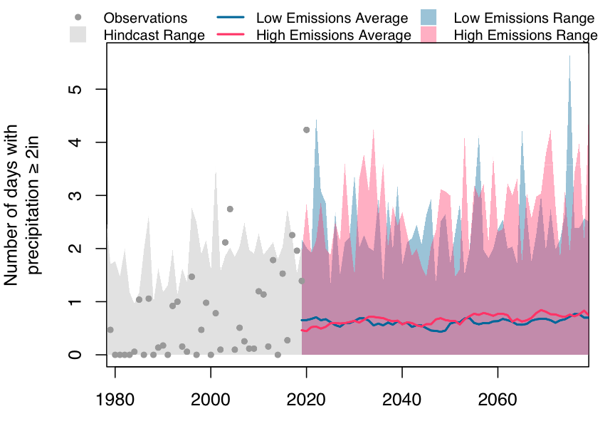</td>
    <td></td>
 </tr>
</table>

##### Diagnostic visualization guidelines/problems:
* **Chart appropriateness - Configuration** (multiple charts on one plot): observations, hindcast and projection ranges, and projection averages are all mapped together. The point of the figure is to depict the trend and the associated uncertainty. Any type of trend is masked by the large range of uncertainty.
* **Visual variable - Choice**: The plot conveys information as dots, solid lines, and transparent polygons. While each conveys a seperate type of information, it adds complexity to the plot.
* **Level of detail - Jaggedness**: Precipitation data is highly variable with peaks/spikes appearing over time in the uncertainty range. The projection averages are smoothed as the 5-year running mean. The jaggedness can obscure the trend and may also lead to inaccurate interpretation. 
* **Clutter - Color mixing**: Low and high emissions ranges overlap making a new color (purple) making it harder to determine what is the low and what is the high range. 
* **Clutter - Overlap**: Observations, hindcast and projection ranges, and projection averages all overlap which can make it more difficult to interprete differences in the ranges.
* **Distortion - Scale inconsistency**: The range in observations and projection uncertainy overpower the trend in the projection averages. As such, reader could interpret no trend/ no changes in the projections.

These problems could lead to user **misinterpretation** of the data, **inaccuracy** in interpreting data estimates and the intent of the plot, **lack of expressiveness** where user interprets the intent of the plot as something else, and **inefficiency** where it takes the user longer to interpret the data and plot intent.

### <a id="B2">Group 2</a>
This is a common plot used. We want to improve upon this style of plotting for precipitation.

##### Variations:
* Bar graph
* Percent change in the number of days with heavy rainfall (2 inches)
* NO observations included
* NO ranges included
* Averages included

##### Take aways:
* RCP45 and RCP85 averages both show a positive trend.
* Extreme events will likely increase by ~40% under RCP45 and ~60% under RCP85.
* There are differences between RCP4.5 (low) and RCP8.5 (high).

<!--  -->

<table border="0">
 <tr>
    <td><b>Pulaski County</b></td>
    <td><b>Appomattox County</b></td>
 </tr>
 <tr>
    <td></td>
    <td></td>
 </tr>
</table>

##### Diagnostic visualization guidelines/problems:
* *Improvement* - **Chart appropriateness - Configuration** (multiple charts on one plot): The bar chart improves this by only showing the hindcast/projection averages.
* *Improvement* - **Visual variable - Choice**: The bar chart improves this by only showing bars. *However, the width of the hindcast bar is double the projection bar which could lead to some confusion.*
* *Improvement* - **Level of detail - Jaggedness**: Precipitation data is highly variable. *Even with the decadal average, some jaggedness precedes which could still impact interpretation.*
* *Improvement* - **Clutter - Color mixing**: The bars do not overlap, removing this issue.
* *Improvement* - **Clutter - Overlap**: The bars do not overlap, removing this issue.
* *Improvement* - **Distortion - Scale inconsistency**: The bar chart improves this by only showing the hindcast/projection averages, so the user can interpret the trend. *However, uncertainty is not plotted and thus a user could misinterpret the magnitude of the trend relative to uncertainty.*

While the bar graph improves upon the line graph on all of the previous issues, problems still exist which could lead to user **lack of expressiveness** where user interprets the changing width of the bars as something important. Also, the fact uncertainty and observations are not plotted and the presitent jaggedness can still lead to misinterpretation and inaccuracy.

### <a id="B3">Group 3</a>
This is an uncommon plot. We want to see if using a different plotting style (one not typically seen) effects their interpretation (i.e., prior graph literacy).

##### Variations:
* Violin graph
* Number of days with heavy rainfall (2 inches)
* Observations included
* Ranges included
* Averages included

##### Take aways:
* RCP45 and RCP85 averages both show a positive although small trend. The average will still stay around 1 day per year.
* The number of extreme events are becoming more skewed with each decade, where some years could see as many as 4 days a year with at least 2 inches of precipitation.
* Some observations correspond with the hindcast peaks. 
* There are minor differences between RCP4.5 (low) and RCP8.5 (high).

<!-- 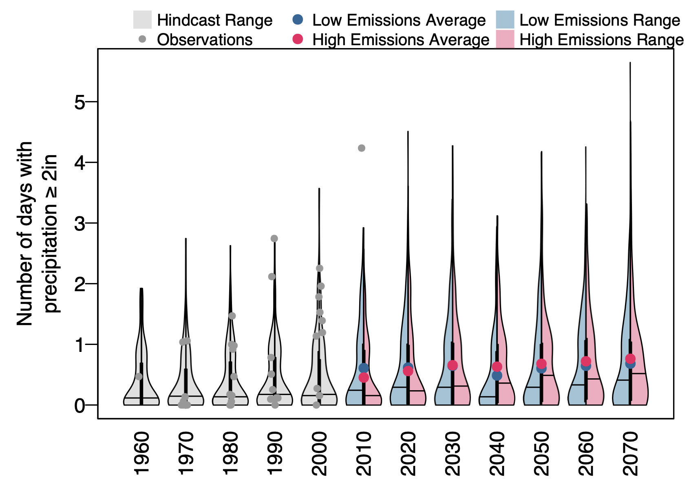 -->

<table border="0">
 <tr>
    <td><b>Pulaski County</b></td>
    <td><b>Appomattox County</b></td>
 </tr>
 <tr>
    <td>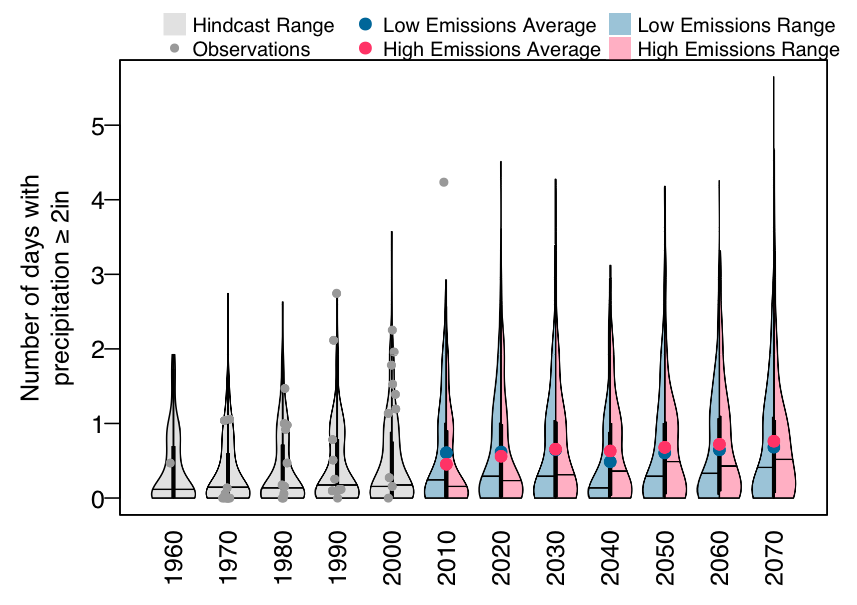</td>
    <td></td>
 </tr>
</table>

##### Diagnostic visualization guidelines/problems:
* **Chart appropriateness - Configuration** (multiple charts on one plot): observations, hindcast and projection ranges, and projection averages are all mapped together. The point of the figure is to depict the trend and the associated uncertainty. Average trends are partially masked by the large range of uncertainty.
* **Visual variable - Choice**: The plot conveys information as dots, solid lines, and transparent polygons. While each conveys a seperate type of information, it adds complexity to the plot.
* *Improvement* - **Level of detail - Jaggedness**: Precipitation data is highly variable. *Even with the decadal average, some jaggedness precedes which could still impact interpretation.*
* *Improvement* - **Clutter - Color mixing**: The violin bars do not overlap, removing this issue. 
* *Improvement* - **Clutter - Overlap**: The violin bars do not overlap, removing this issue. *However, observations still overlap the hindcast*.
* **Distortion - Scale inconsistency**: The range in observations and projection uncertainy overpower the trend in the projection averages. As such, reader could interpret no trend/ no changes in the projections.

The violin graph improves upon some of the line graph issues while still plotting the uncertainty and observations (unlike the bar graph). However, problems still exist which could lead to **lack of expressiveness**, **misinterpretation**, and **inaccuracy**.

### <a id="B4">Group 4</a>
IDF curves are more of an expert level graph, specialized. It is common among engineers, but likely less so among more general users. In using this plot we would see how well people interpret a more compilcated graph.

##### Variations:
* IDF graph
* 2, 5, 10, 25, 50, 100-yr return period
* NO oservations included
* NO Ranges included
* Averages included
* * Time period 1950-1999 compared to 2020-2069

##### Take aways:
* The current plot is ugly and needs to be redone
* RCP45 and RCP85 average both show that storms are increasing in intensity. For example, it would take ~3hr for 2 inches of precipitation to accrue under a 10-yr event, however under RCP4.5 and RCP8.5 2inches of precipitation could fall in under 1 hour for a 10-yr event.
* There are minor differences between RCP4.5 (low) and RCP8.5 (high).

### Pulaski County
<table border="0">
 <tr>
    <td><b>2020-2069</b></td>
    <td><b>2050-2099</b></td>
 </tr>
 <tr>
    <td></td>
    <td>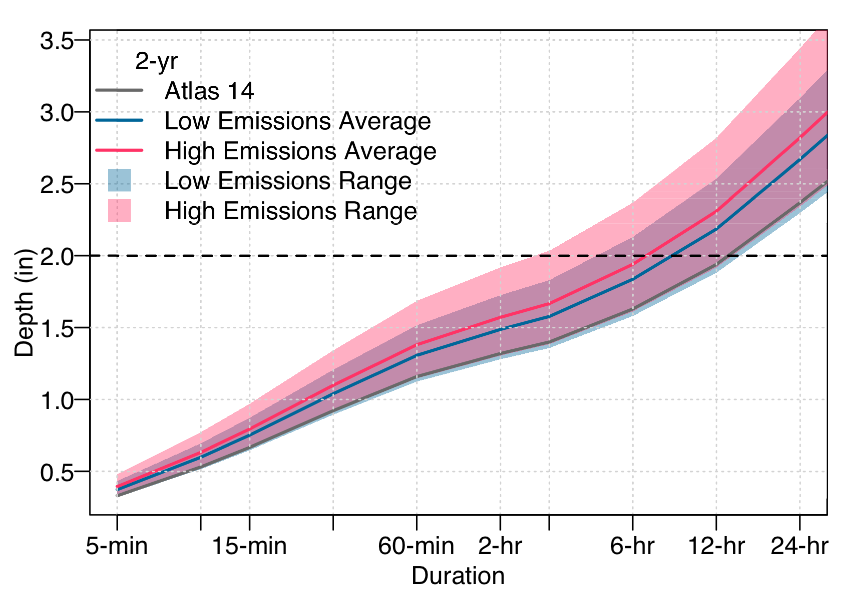</td>
 </tr>
  <tr>
    <td>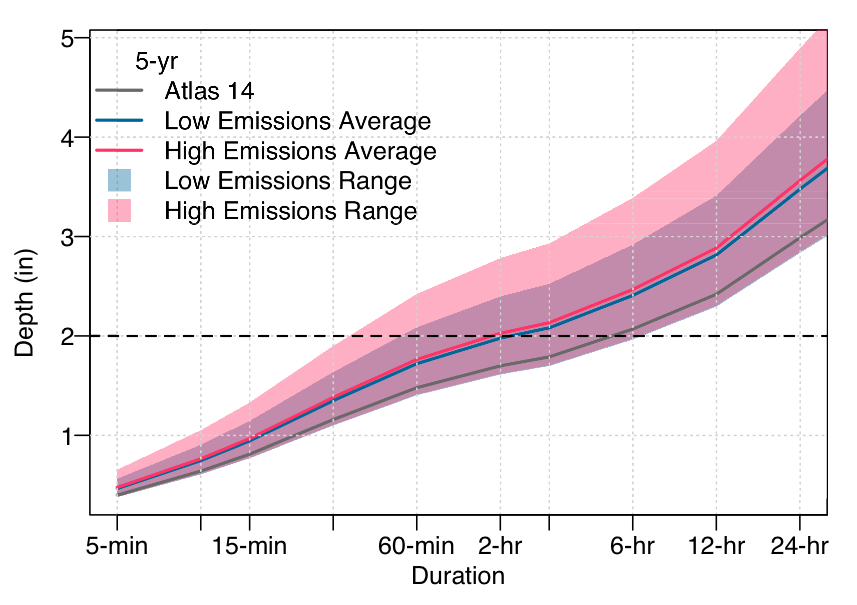</td>
    <td></td>
 </tr>
   <tr>
    <td>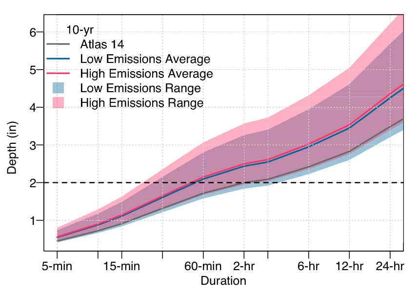</td>
    <td>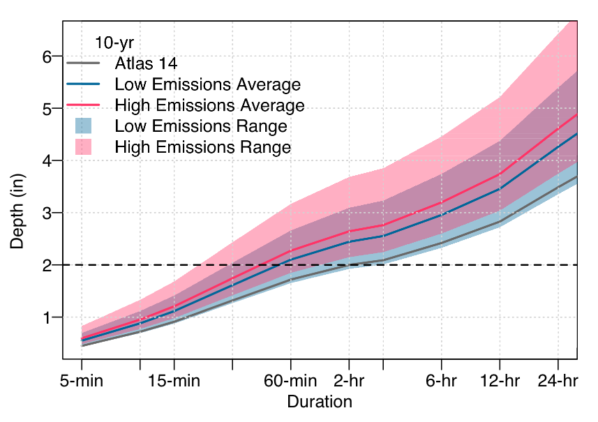</td>
 </tr>
   <tr>
    <td>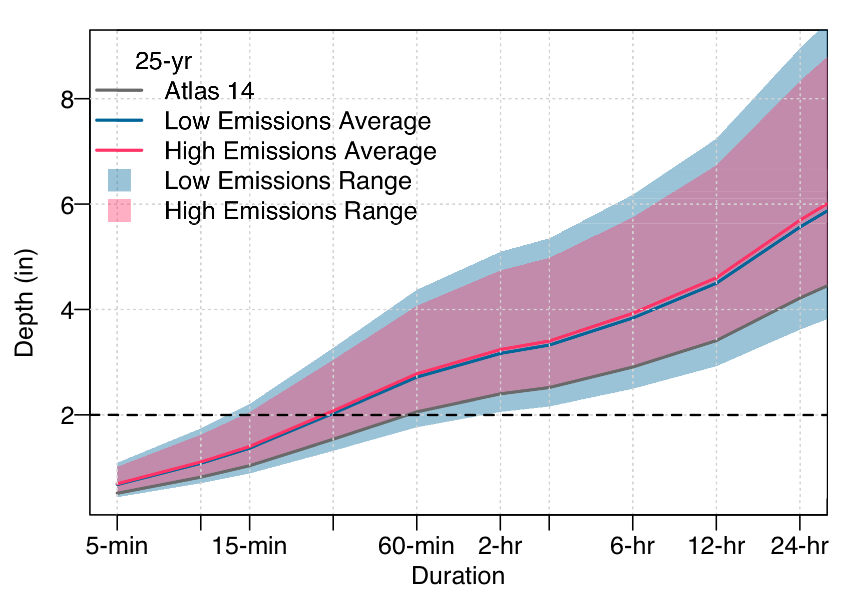</td>
    <td></td>
 </tr>
   <tr>
    <td></td>
    <td></td>
 </tr>
   <tr>
    <td></td>
    <td></td>
 </tr>
</table>

### Appomattox
<table border="0">
 <tr>
    <td><b>2020-2069</b></td>
    <td><b>2050-2099</b></td>
 </tr>
 <tr>
    <td></td>
    <td>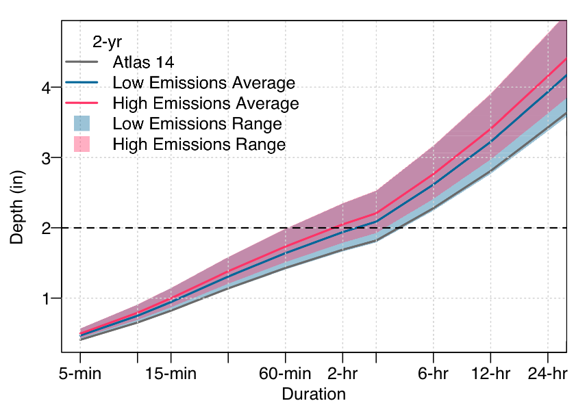</td>
 </tr>
  <tr>
    <td></td>
    <td>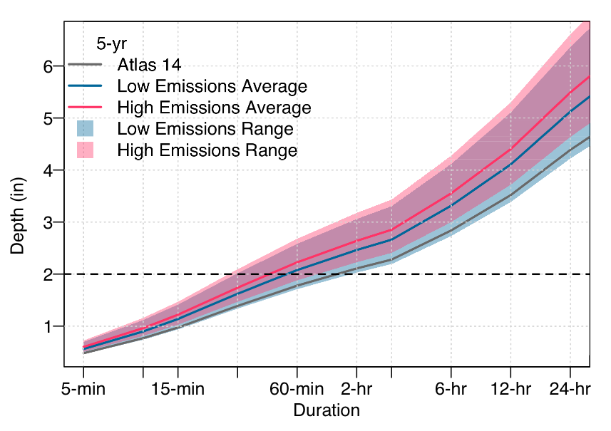</td>
 </tr>
   <tr>
    <td></td>
    <td></td>
 </tr>
   <tr>
    <td></td>
    <td></td>
 </tr>
   <tr>
    <td></td>
    <td></td>
 </tr>
   <tr>
    <td>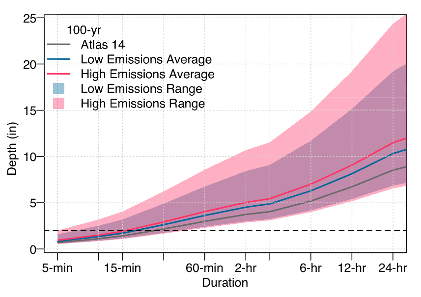</td>
    <td>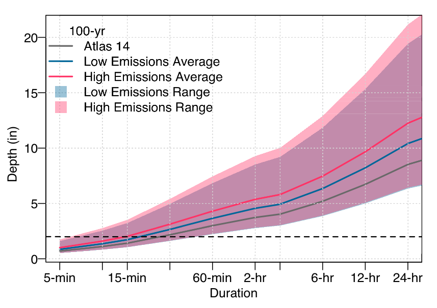</td>
 </tr>
</table>

##### Diagnostic visualization guidelines/problems:
* *Improvement* - **Chart appropriateness - Configuration** (multiple charts on one plot): Atlas 14 (observations), projection ranges, and projection averages are all mapped together. Average trends are not masked by the range of uncertainty. However, the main point of all the different graphs are to interpret changes in extreme precipitation, specifically at least 2inches per day. Unless 2 inches is highlighted, that can be lost.
* **Visual variable - Choice**: The plot conveys information as solid lines and transparent polygons. While each conveys a seperate type of information, it adds complexity to the plot. Additionally, we would have to choice one storm event to reduce complexity and only one snapshot in time is shown (50 year average versus 50 year average in the future). 
* *Improvement* - **Level of detail - Jaggedness**: The data is not jagged and plotted on a log scale. 
* **Clutter - Color mixing**: The ranges overlap creating a new color not in the legend. 
* **Clutter - Overlap**: The ranges overlap creating a new color not in the legend. 
* *Improvement* - **Distortion - Scale inconsistency**: The range in uncertainty does not overpower the trends in projection averages. 

The IDF curve significantly improves on the probability of **misinterpretation** and **inaccuracy**. However, the overlapping ranges, multiple variables, and underlying complexity of understanding intensity, duration, and frequency can lead to **lack of expressiveness** and **inefficiency**.

<!--
<table border="0">
 <tr>
    <td><b>2020-2069</b></td>
    <td><b>2050-2099</b></td>
 </tr>
 <tr>
    <td></td>
    <td>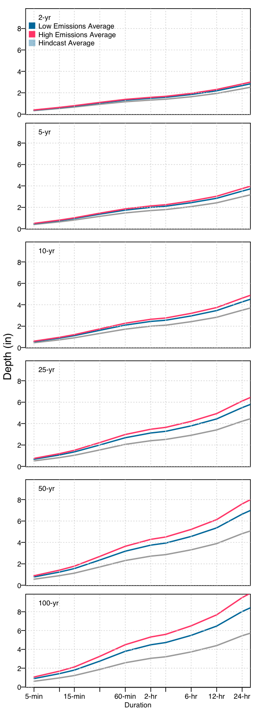</td>
 </tr>
</table>
-->

## <a id="C">C. Seasonal Graph</a>

### <a id="C1">Group 1</a>
##### Variations:
* Polygon/ line graph
* Number of days with heavy rainfall (2 inches)
* Observations included
* Ranges included
* Averages included
* 4 seasons

##### Take aways:
* There does not appear to be much change in the average over time.
* The majority of extreme events occurance in summer and fall.
* There are minor differences between RCP4.5 (low) and RCP8.5 (high).
* The maximum spikes appear to be increasing over time.

### Pulaski
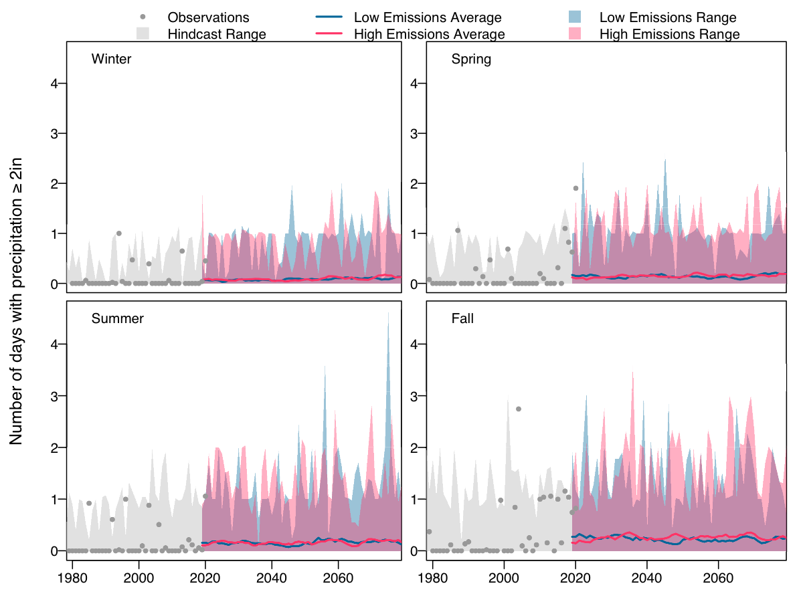

### Appomattox

### <a id="C2">Group 2</a>
##### Variations:
* Bar graph
* Percent change in the number of days with heavy rainfall (2 inches)
* NO observations included
* NO ranges included
* Averages included

##### Take aways:
* RCP45 and RCP85 averages both show a positive trend in winter, spring, and summer.
* Extreme events are increasing the most in winter and spring. 
* There are differences between RCP4.5 (low) and RCP8.5 (high).

### Pulaski

### Appomattox
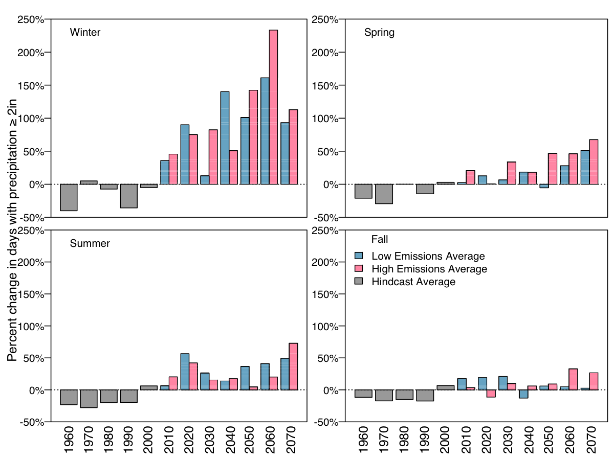

### <a id="C3">Group 3</a>
##### Variations:
* Violin graph
* Number of days with heavy rainfall (2 inches)
* Observations included
* Ranges included
* Averages included

##### Take aways:
* It is hard to detect any change in the RCP45 and RCP85 averages.
* The number of extreme events are becoming more skewed with each decade.
* The majority of extreme events occurance in summer and fall.
* Some observations correspond with the hindcast peaks. 
* There are minor differences between RCP4.5 (low) and RCP8.5 (high).

### Pulaski
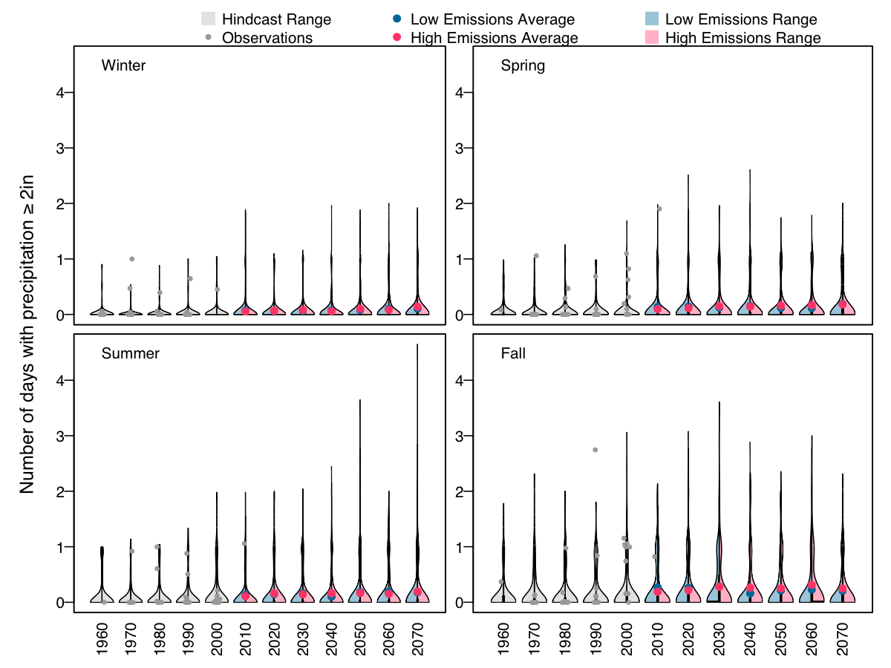

### Appomattox

### <a id="C4">Group 4</a>
Seasonal cycle graphs are "common" in climate information for regions and possibly more familir to a nonexpert user. Seasonal cycles plots also benefit by providing monthly data over seasons.

##### Variations:
* Seasonal cycle graph
* Number of days with heavy rainfall (2 inches)
* NO oservations included
* Ranges included
* Averages included
* Time period 1950-1999 compared to 2020-2069

##### Take aways:
* The RCP45 and RCP85 averages are greater than the hindcast average across all months, indicating there will likely be a increase in the average number of events throughout the year.
* The number of extreme events are becoming more skewed with each decade.
* The majority of extreme events occur in late summer peaking in September.
* Maximum ranges indicate more extreme events could occur in spring (March) as well as a longer peak in the summer from August through October. 
* There are minor differences between RCP4.5 (low) and RCP8.5 (high).

### Pulaski
<table border="0">
 <tr>
    <td><b>2020-2069</b></td>
    <td><b>2050-2099</b></td>
 </tr>
 <tr>
    <td>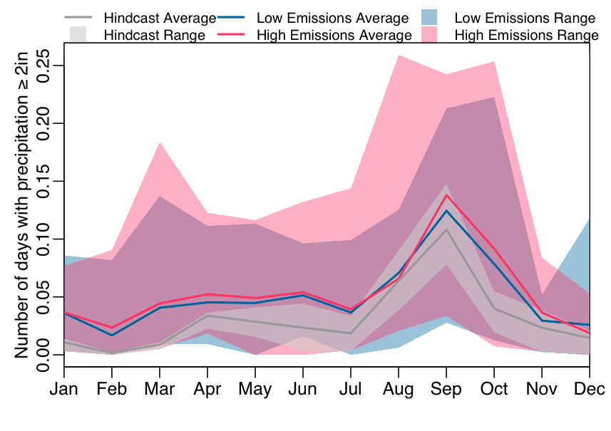</td>
    <td>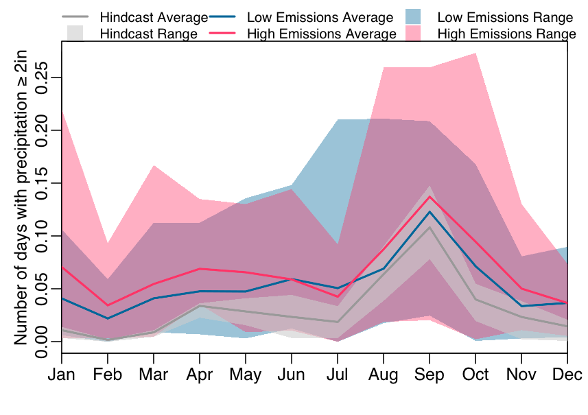</td>
 </tr>
  <tr>
    <td></td>
    <td></td>
 </tr>
</table>

### Appomattox
<table border="0">
 <tr>
    <td><b>2020-2069</b></td>
    <td><b>2050-2099</b></td>
 </tr>
 <tr>
    <td></td>
    <td></td>
 </tr>
  <tr>
    <td></td>
    <td></td>
 </tr>
</table>

##### Diagnostic visualization guidelines/problems:
* **Chart appropriateness - Configuration** (multiple charts on one plot): hindcast and projection ranges, and projection averages are all mapped together. Average trends are not masked by the range of uncertainty.
* **Visual variable - Choice**: The plot conveys information as solid lines and transparent polygons. While each conveys a seperate type of information, it adds complexity to the plot.
* **Level of detail - Jaggedness**: The data is fairly jagged, likely due to the fact is monthly averages even though its across 50 years. 
* **Clutter - Color mixing**: The ranges overlap creating a new color not in the legend. 
* **Clutter - Overlap**: The ranges overlap creating a new color not in the legend. 
* *Improvement* - **Distortion - Scale inconsistency**: The range in uncertainty does not overpower the trends in projection averages. 

The seasonal cycle improves upon potential inaccuracy due to scale inconsistencies and gives a clearly story across the year than season plots. However, **misinterpretation**, **lack of expressiveness**, and **inefficiency** still presist.